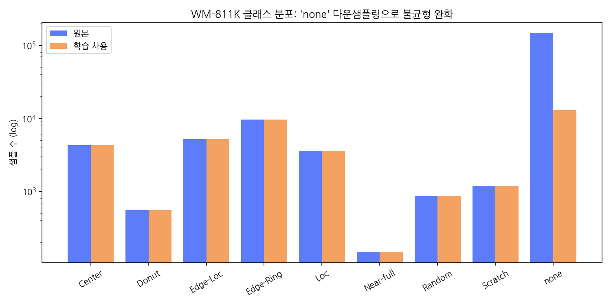
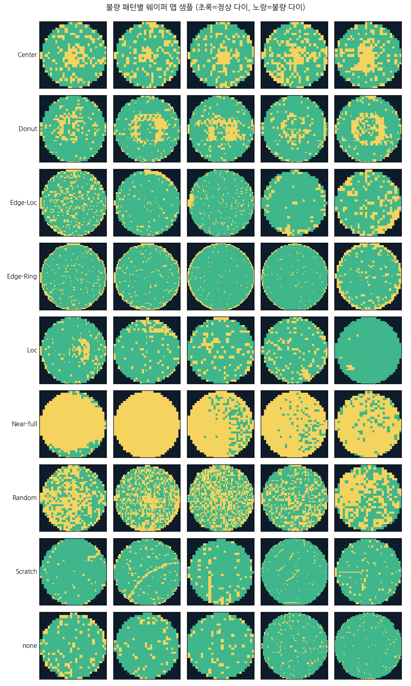
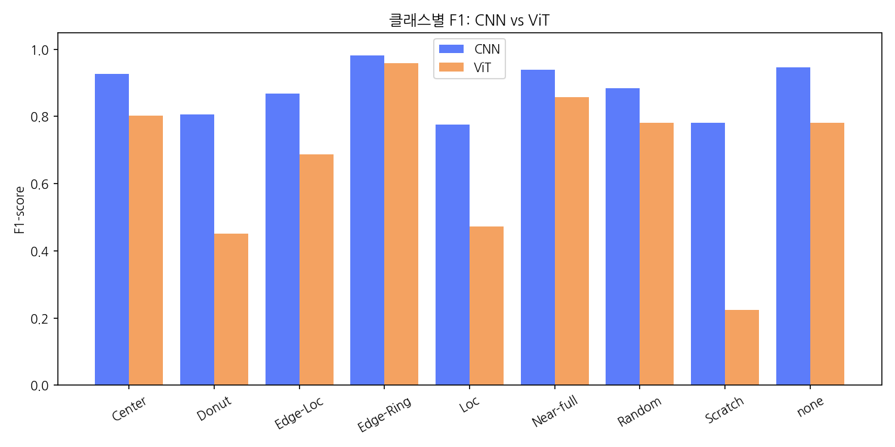
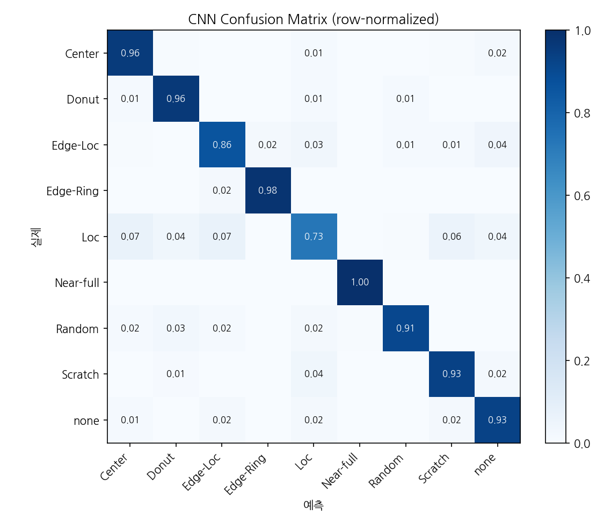
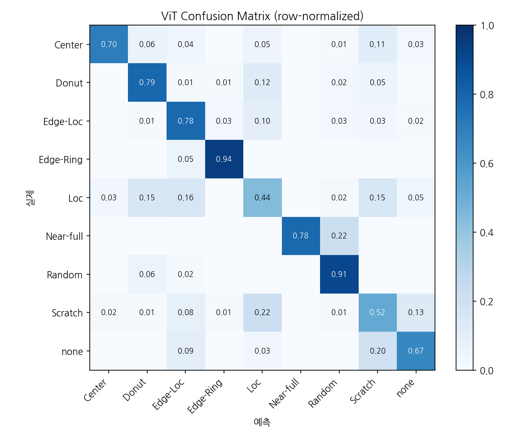
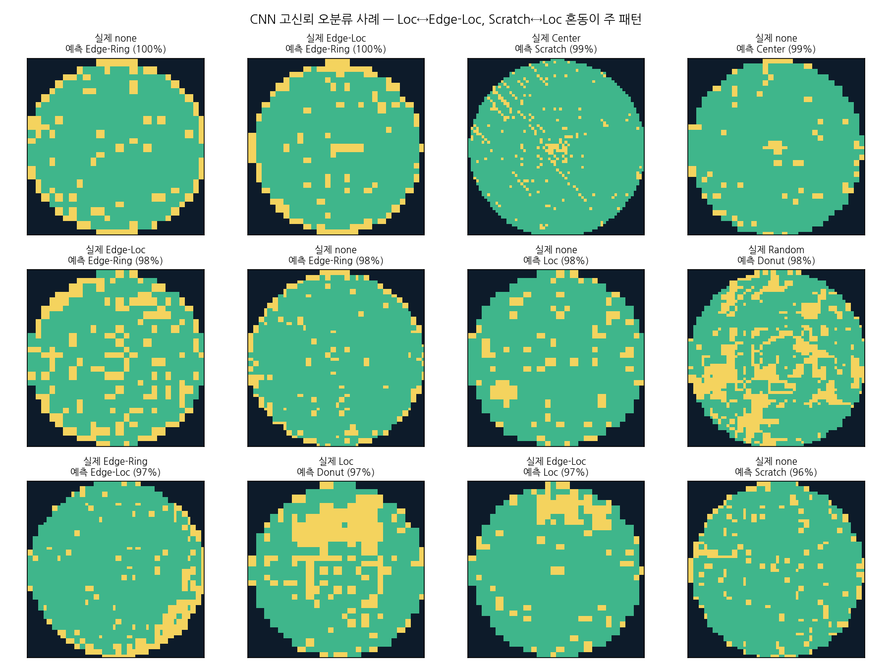
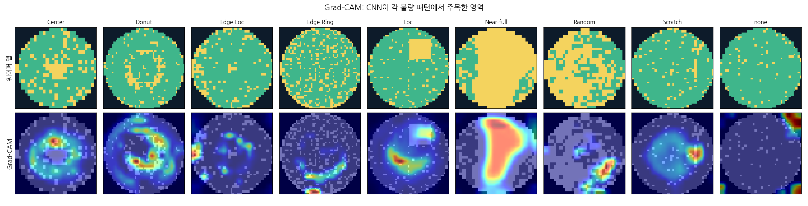

# 반도체 웨이퍼 맵 불량 패턴 분류 및 품질 진단 대시보드

> 웨이퍼 맵 이미지를 기반으로 반도체 불량 패턴을 분류하고, 모델 성능과 불량 유형별 분포를 시각화하여 품질관리 관점에서 이상 원인을 분석할 수 있도록 구현한 개인 프로젝트입니다.

## 프로젝트 배경

기존에는 번호판 인식(NextFrame ALPR) 프로젝트로 YOLO 기반 이미지 탐지·OCR·성능 평가를 경험했고, 이후 데이터 품질 스코어카드 프로젝트를 통해 Streamlit 기반 진단 결과 시각화 구조를 경험했습니다. 이를 확장해 **반도체 품질 분야에서 실제로 활용되는 웨이퍼 맵 불량 패턴 분류 모델과 품질 진단 대시보드**를 개인 프로젝트로 구현했습니다.

## 데이터셋: WM-811K (LSWMD)

- 실제 반도체 팹에서 수집된 **811,457장**의 웨이퍼 맵 (46,393 로트)
- 각 픽셀 값: `0=배경`, `1=정상 다이`, `2=불량 다이`
- 이 중 라벨이 부여된 **172,950장**을 사용, 9개 클래스(8개 불량 패턴 + none) 분류

| 클래스 | 원본 수량 | 학습 사용 | 공정 관점 의심 원인 |
|---|---:|---:|---|
| Center | 4,294 | 4,294 | CMP/증착 중심부 이상 |
| Donut | 555 | 555 | 스핀 코팅 회전 불균일 |
| Edge-Loc | 5,189 | 5,189 | 엣지 핸들링/척 접촉 |
| Edge-Ring | 9,680 | 9,680 | 베벨 식각·열처리 경계 |
| Loc | 3,593 | 3,593 | 국부 파티클 오염 |
| Near-full | 149 | 149 | 공정 전면 이상 |
| Random | 866 | 866 | 랜덤 파티클(클린룸) |
| Scratch | 1,193 | 1,193 | 이송 장비 접촉 |
| none | 147,431 | 13,000 | 정상 (다운샘플링) |

`none`이 전체의 85%를 차지하는 극단적 불균형 → **다운샘플링(13,000장) + 클래스 가중치**로 이중 보정했습니다. 최종 학습 데이터는 38,519장(train 26,961 / val 5,774 / test 5,784, 층화 분할)입니다.




## 파이프라인

```
LSWMD.pkl (2GB, 2019년 pandas 0.19 피클)
  └─ prepare_data.py   레거시 피클 호환 셤 + latin1 디코딩 → 64x64 리사이즈
                       → wm811k_64.npz (9.4MB)
  └─ eda.py            클래스 분포 / 샘플 시각화
  └─ train_cnn.py      Keras CNN baseline (증강 + class_weight)
  └─ train_vit.py      HuggingFace ViT(google/vit-base-patch16-224-in21k) fine-tuning
  └─ evaluate.py       accuracy / F1 / confusion matrix / 모델 비교 / 오분류 분석
  └─ gradcam.py        Grad-CAM으로 모델 판단 근거 시각화
  └─ app/streamlit_app.py  진단 대시보드 (업로드 → 예측 + 신뢰도 + Grad-CAM)
```

### 기술 포인트

1. **레거시 데이터 호환 처리** — LSWMD.pkl은 pandas 0.19/Python 2 시절 피클이라 최신 pandas에서 `ModuleNotFoundError: pandas.indexes`, `UnicodeDecodeError`가 발생합니다. 가짜 모듈 등록(shim)과 `encoding='latin1'`로 해결했습니다.
2. **도메인 반영 입력 인코딩** — 픽셀값 0/1/2를 단순 정규화하지 않고 **3채널 one-hot(배경/정상/불량)** 으로 분리해 모델이 다이 상태를 명확히 구분하도록 설계했습니다.
3. **대칭성 기반 증강** — 웨이퍼 불량 패턴은 회전·반전해도 클래스가 유지되므로 90° 회전 + 상하/좌우 반전 증강을 적용해 소수 클래스(Donut 555장, Near-full 149장)를 보완했습니다.
4. **파이프라인 사전 검증** — GPU 학습 전에 RandomForest(26x26)로 라벨 학습 가능성을 확인했습니다: accuracy 78.3% / macro-F1 0.647. 이 수치가 딥러닝 모델의 최소 기준선(baseline floor)이 됩니다.

## 실행 방법

```bash
pip install -r requirements.txt

# 1. 전처리 (LSWMD.pkl 필요 — Kaggle: qingyi/wm811k-wafer-map)
python src/prepare_data.py --pkl /path/to/LSWMD.pkl --out data

# 2. EDA
python src/eda.py

# 3. 학습 (Colab T4 권장 — notebooks/colab_train.ipynb 참고)
cd src
python train_cnn.py --epochs 30 --data ../data/wm811k_64.npz     # 약 10~15분
python train_vit.py --epochs 3 --data ../data/wm811k_64.npz      # 약 40~50분

# 4. 평가 + Grad-CAM
ln -sf ../data data
python evaluate.py
python gradcam.py
cd ..

# 5. 대시보드
streamlit run app/streamlit_app.py
```

## 결과 요약

| 모델 | Accuracy | Macro-F1 | 비고 |
|---|---|---|---|
| RandomForest (사전 검증) | 0.783 | 0.647 | 26x26, 파이프라인 검증용 |
| **Keras CNN** | **0.918** | **0.879** | 1.2M 파라미터, 증강+가중치, 30 epoch |
| HuggingFace ViT | 0.737 | 0.668 | ImageNet-21k 사전학습 파인튜닝, 3 epoch |

### 클래스별 F1

| 클래스 | CNN F1 | ViT F1 |
|---|---|---|
| Center | 0.927 | 0.802 |
| Donut | 0.806 | 0.451 |
| Edge-Loc | 0.868 | 0.687 |
| Edge-Ring | 0.982 | 0.959 |
| Loc | 0.777 | 0.473 |
| Near-full | 0.939 | 0.857 |
| Random | 0.885 | 0.780 |
| Scratch | 0.781 | 0.224 |
| none | 0.946 | 0.780 |







### 분석

- **CNN이 ViT를 모든 지표에서 상회**(accuracy +18.1%p, macro-F1 +21.1%p). 웨이퍼 맵은 0/1/2 세 값만 갖는 희소한 그리드 패턴으로, 지역적 합성곱 연산(local convolution) 기반 CNN이 전역 어텐션(global attention) 기반 ViT보다 이런 저수준 공간 패턴을 포착하는 데 더 적합했습니다.
- **소수 클래스에서 격차가 극대화**: Scratch(1,193장, ΔF1 0.56), Donut(555장, ΔF1 0.36)처럼 원본 샘플이 적은 클래스일수록 ViT의 성능 저하가 뚜렷합니다. 8600만 파라미터급 사전학습 모델도 도메인이 크게 다른 소량 데이터(26,961장)로 3 epoch만 파인튜닝하면 충분히 수렴하지 못한다는 것을 보여줍니다.
- **Edge-Ring은 두 모델 모두 최고 성능**(CNN 0.982 / ViT 0.959) — 링 형태가 이미지 전체에 걸쳐 뚜렷하게 나타나는 패턴이라 두 아키텍처 모두 잘 학습했습니다.
- **혼동 패턴**: Loc↔Edge-Loc, Scratch↔Loc은 공간적 정의가 겹쳐 사람도 판단이 갈리는 구간 → `misclassified_examples.png`에서 고신뢰 오분류 사례 확인
- **Grad-CAM**: 모델이 실제 불량 다이 군집 위치를 근거로 판단하는지 검증 → 품질 담당자에게 "왜 이 판정인지" 설명 가능
- **결론**: 이미지 도메인이 자연 이미지와 크게 다르고 데이터가 제한적인 상황에서는, 사전학습된 대형 트랜스포머보다 태스크에 맞게 설계한 경량 CNN이 더 실용적인 선택이 될 수 있습니다. 실제 배포 모델은 **CNN을 채택**했습니다.

## 반도체 품질관리 활용 가능성

1. **불량 원인 역추적**: 불량 패턴은 공정 이상의 지문입니다. Edge-Ring 급증 → 베벨 식각 장비 점검, Scratch 급증 → 이송 로봇 점검처럼 패턴 분류 결과가 곧 점검 우선순위가 됩니다.
2. **검사 자동화**: 육안 분류에 의존하던 웨이퍼 맵 판독을 자동화해 판독 시간 단축 및 검사자 간 편차 제거.
3. **라인 모니터링 대시보드**: 유형별 발생 추이를 실시간 집계하면 특정 패턴의 급증을 조기 경보로 활용할 수 있습니다 (대시보드 '품질 현황' 탭에 개념 구현).
4. **설명 가능성(XAI)**: Grad-CAM으로 판정 근거 영역을 제시해, 품질 엔지니어가 모델 판정을 신뢰하고 검증할 수 있는 구조를 마련했습니다.
5. **모델 선택 근거**: 대형 사전학습 모델(ViT)이 항상 우수한 건 아니며, 도메인 특성과 데이터 규모를 고려한 경량 모델(CNN) 채택이 더 실용적일 수 있다는 실증적 의사결정 사례.

## 프로젝트 구조

```
wafer-defect-classification/
├── README.md
├── requirements.txt
├── data/
│   ├── wm811k_64.npz          # 전처리 완료 데이터 (9.4MB)
│   └── class_names.json
├── src/
│   ├── prepare_data.py        # LSWMD.pkl → npz (레거시 피클 호환 처리 포함)
│   ├── eda.py
│   ├── utils.py
│   ├── train_cnn.py           # Keras CNN baseline
│   ├── train_vit.py           # HuggingFace ViT fine-tuning
│   ├── evaluate.py            # 비교 평가 + 오분류 분석
│   └── gradcam.py             # 설명 가능 AI
├── app/
│   └── streamlit_app.py       # 품질 진단 대시보드
├── notebooks/
│   └── colab_train.ipynb      # T4 GPU 학습 노트북
├── models/
│   ├── cnn_best.keras
│   └── vit_best/
└── outputs/
    ├── model_comparison.md
    └── figures/
```
